# Aetherfall — Echoes of the Shattered Sky

A pixel-art action RPG with anime cutscenes that runs in the browser. It has Souls-style
dodge-roll combat, Diablo-style loot, a skill tree, five boss fights and an endless post-game.
The art, music and sound effects are all generated in code; the repo contains no image or audio files.

**▶ Play it: https://caseyrmorrison.github.io/aetherfall/**


|                                                                     |                                                                         |
| ------------------------------------------------------------------- | ----------------------------------------------------------------------- |
|                          |                   |
|       |        |
|                   |  |
| 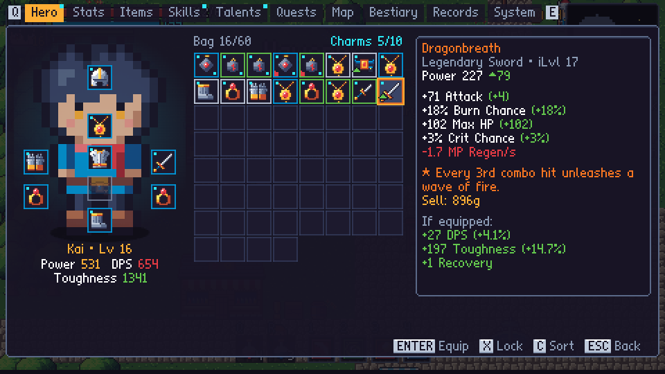 | 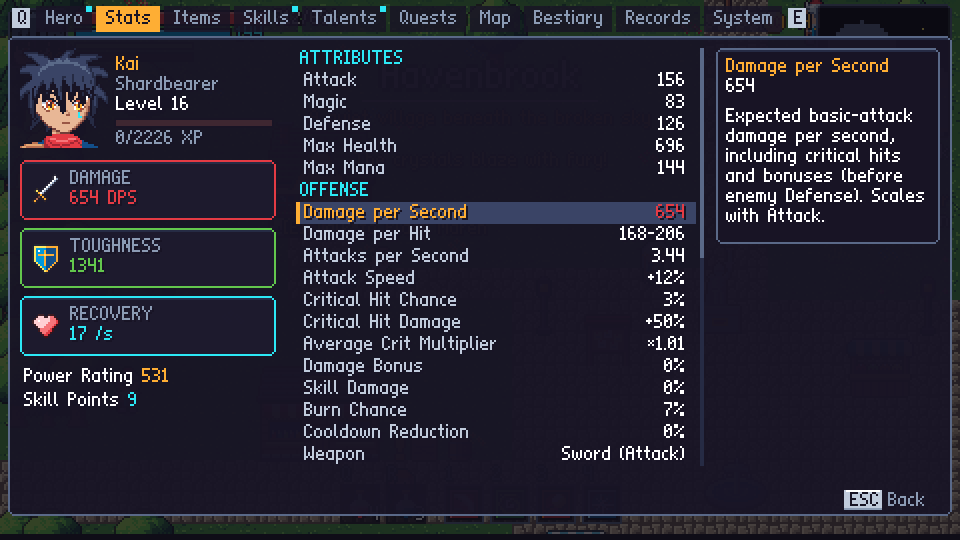                    |

**Dragon Ball–style moments**

|                                                             |                                                                      |
| ----------------------------------------------------------- | -------------------------------------------------------------------- |
| 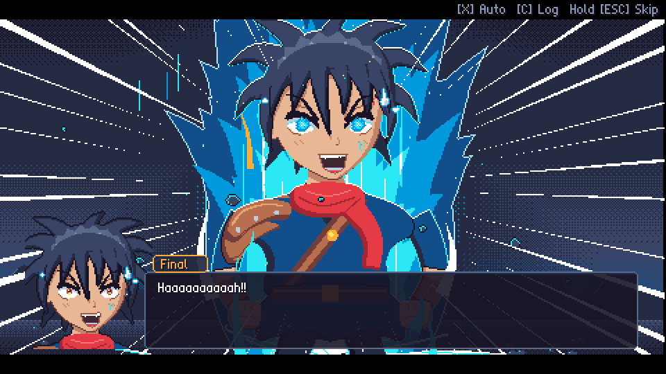      | 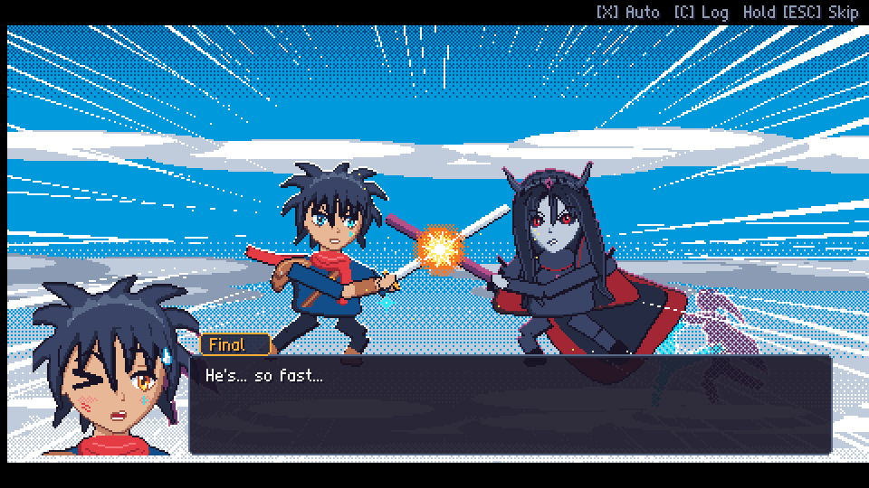        |
| 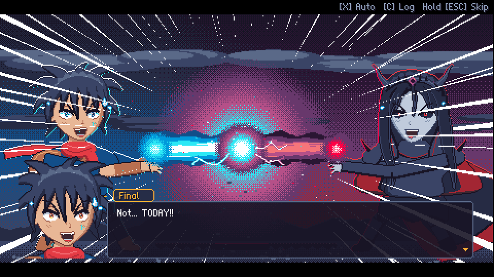       | 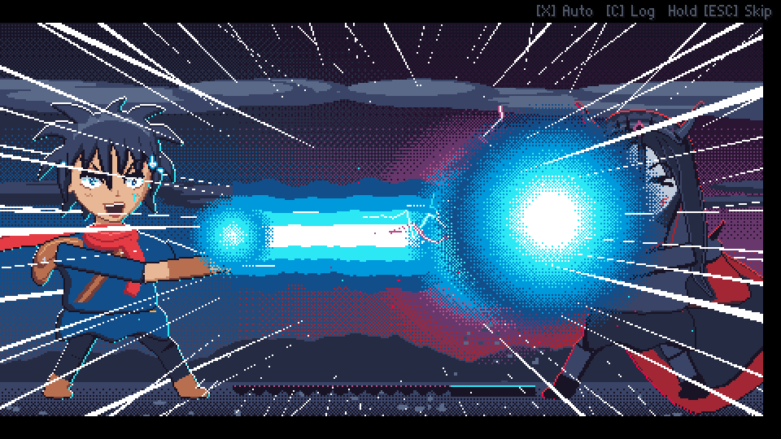                |
| 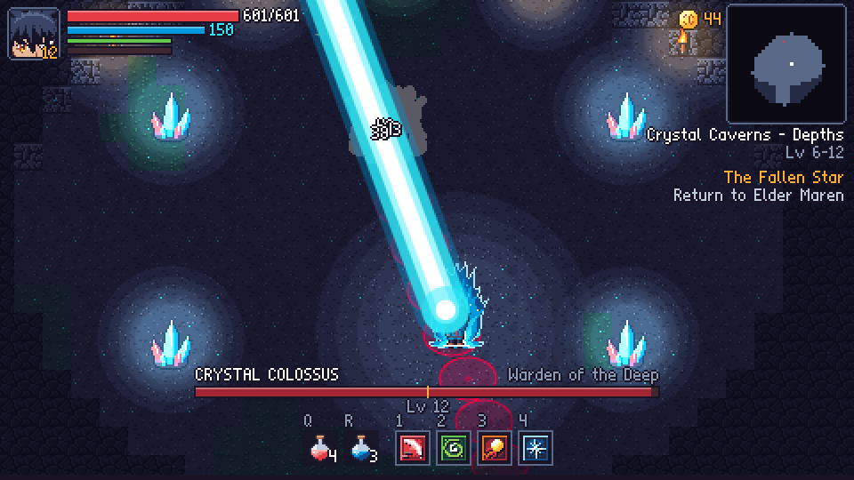 | 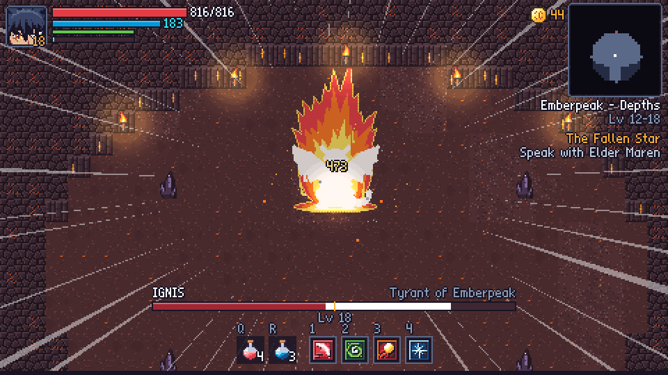 |

**The Abyss: Abyssal items and gems**

|                                                                                    |                                                                     |
| ---------------------------------------------------------------------------------- | ------------------------------------------------------------------- |
| 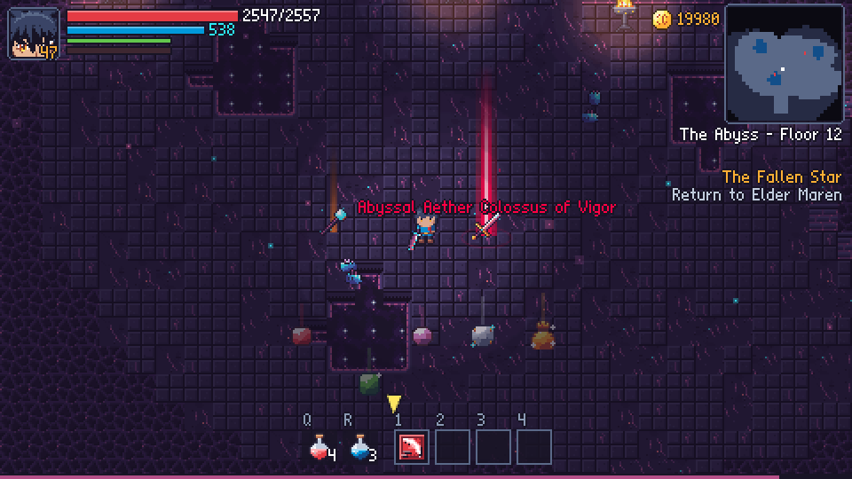 | 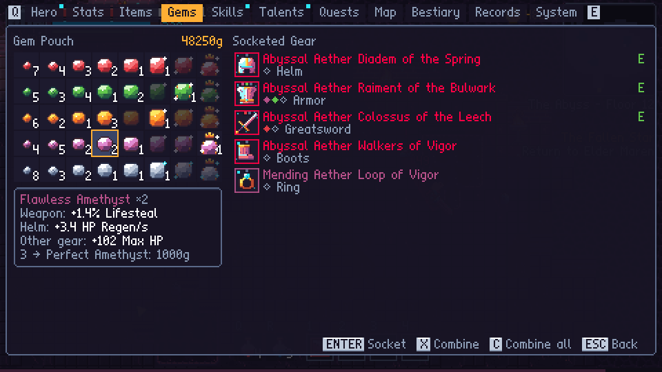 |
| 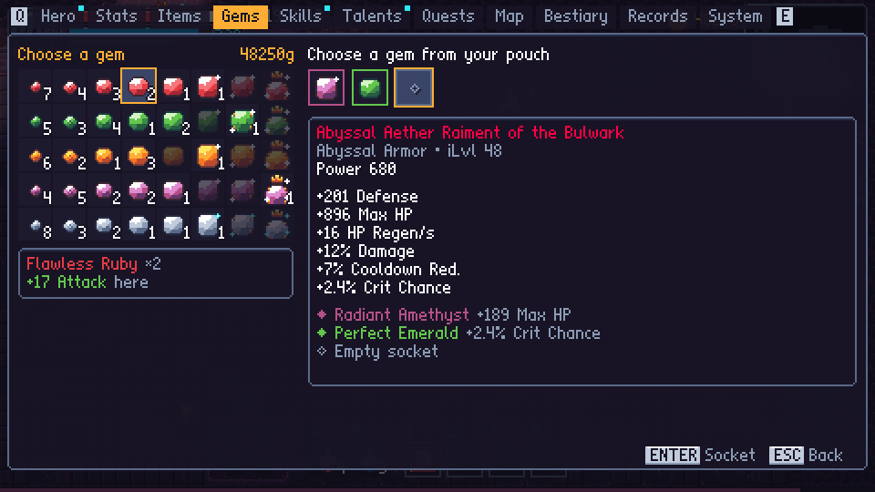         |                                                                     |

**Endgame progression**

|                                                                         |                                                                     |
| ----------------------------------------------------------------------- | ------------------------------------------------------------------- |
| 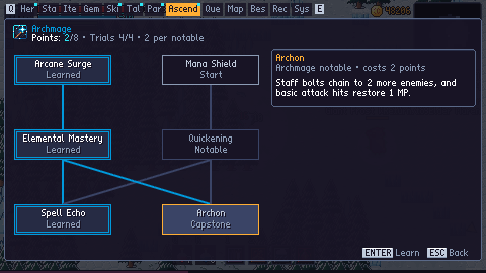          | 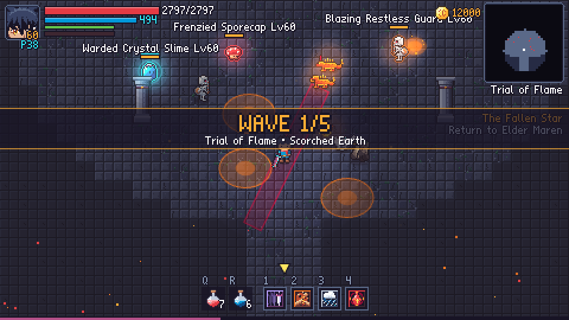 |
| 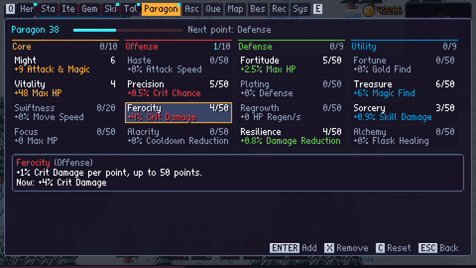                         | 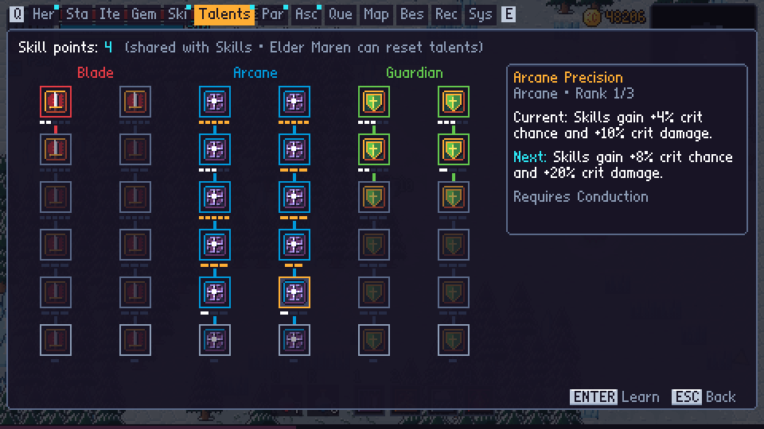 |
| 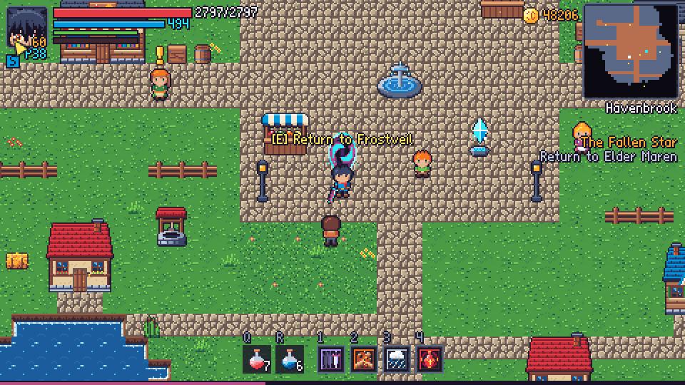 | 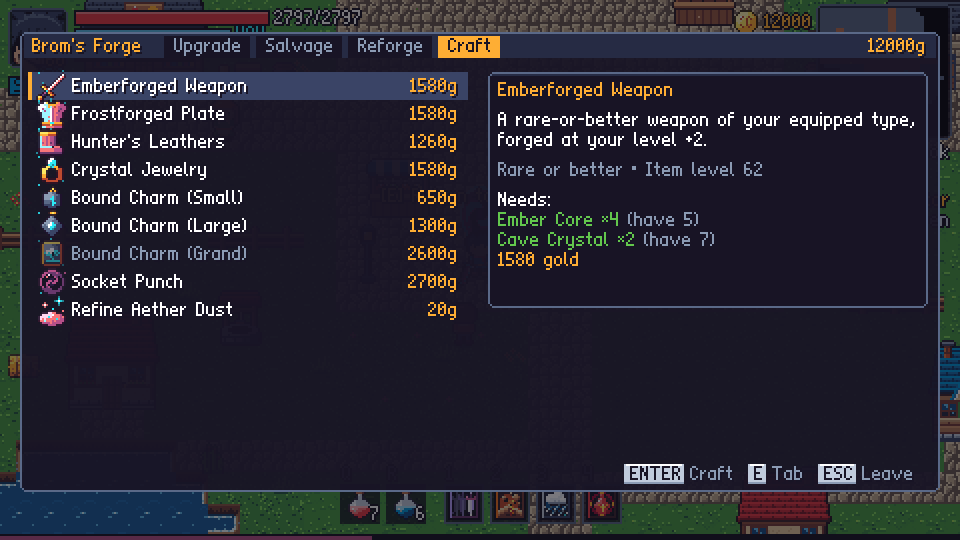          |
| 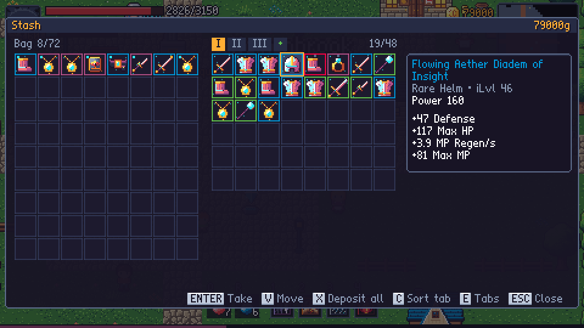                        |                                                                     |

## Features

- **Action combat.** Three-hit weapon combos, a dodge roll with invulnerability frames, and a _perfect dodge_
  (roll just as an attack lands) that slows time. Every enemy attack has a readable wind-up, so fights are hard but fair.
- **Anime cutscenes.** Illustrated story scenes in a PC-98 style, character portraits with 9 expressions,
  ultimate-attack cut-ins, "VS" boss intros, speed lines, a typewriter text effect, and hold-to-skip.
  Dragon Ball–style moments include screaming power-ups with flaming auras, a mid-air rush exchange,
  a beam struggle in the finale, and manga "impact frames" with zoom punches.
- **Aether Cannon.** The ultimate is a full-screen energy beam that follows its cut-in, and bosses that
  reach a new phase freeze the fight to power up with an aura and a shockwave.
- **Five zones and five bosses.** Each boss has multiple phases and telegraphed patterns, and there's a
  transformation for the final boss. Zones are generated procedurally but always the same (seeded), and every run
  checks that all key locations are reachable.
- **Grind as much as you like.** Enemies respawn when you rest. Loot comes in five rarities (six, counting the
  Abyss-only Abyssal tier) with random affixes, and there are 10 legendaries with unique effects. Elite monsters
  have modifiers such as Frenzied, Vampiric and Warded. There are repeatable bounties and a blacksmith who
  upgrades (+10), salvages and reforges gear.
- **Character build.** 12 active skills, each with 5 ranks, plus an ultimate, and 36 talents in three trees
  (two columns each, with a capstone at the bottom of every column). Talents can be reset at any time.
- **Challenge skills.** Four skills are only learned by beating hard challenges: Shadow Step (kill 30 enemies
  in a row without getting hit), Earthshatter (beat a guardian on Hard+ without a flask), Blizzard (beat a
  guardian without getting hit) and Blood Rite (clear 10 Abyss floors in a row without dying).
- **Ascendancies (Path of Exile 2 style).** The statue in the square offers four Trials of Ascension: wave
  survival arenas with twists like Haste, raining fire and no flasks. Each grants points for one of four
  specializations: Blademaster, Warbringer, Shadowblade or Archmage, each with six build-defining notables.
- **Paragon (Diablo 3 style).** After level 60, XP keeps earning Paragon levels with points in Core, Offense,
  Defense and Utility. Main stats are uncapped; points can be moved around for free.
- **Crafting.** Mira brews Elixirs, tonics and Phoenix Feathers, and Brom forges rare-or-better gear at your
  level +2, never-cursed charms, Aether Dust and gem sockets, all from the materials monsters drop.
- **Town portals.** Press T to open a portal home, sell and craft, then step back through: the area is exactly
  as you left it, loot on the ground included.
- **Storage.** A tabbed stash chest in town, shared by all three save slots (buy more tabs), Bag Expansions and
  Charm Satchels from Mira, and
  manual sorting: drag and drop items (or use Move) to arrange your bag and pick which charms are active.
- **Character sheet and paper doll.** Gear slots sit on the hero's body (head, neck, chest, hands, two rings,
  waist, feet, main hand). A Diablo / Path of Exile–style Stats tab shows DPS, toughness, damage reduction,
  attacks per second, recovery and every other stat, each with an explanation.
- **Charms.** Charms work from your bag (up to 10 at once) and roll random bonuses. Cursed charms are much
  stronger but carry a drawback. Mira sells Mystery Charms as a gamble, and Brom can reforge them.
- **Post-game.** An endless Abyss tower that scales with depth, with a boss every 5th floor, and New Game+.
- **Abyssal items.** The rarest tier drops only in the Abyss (mostly from the boss every 5th floor). Abyssal items
  have much higher base stats, four high-rolled affixes plus a big bonus, and 1–3 gem sockets.
- **Gems.** Rubies, emeralds, topazes, amethysts and diamonds drop only in the Abyss, in eight qualities from
  Chipped to Royal; deeper floors drop better ones. As in Diablo, a gem gives a different stat depending on where
  it's socketed (weapon, helm or other gear), and three gems combine into one of the next quality for gold.
  Socket, swap and combine anywhere from the Gems tab; selling or salvaging an item returns its gems.
- **Modern conveniences:**
  - autosave, 3 save slots, and save export/import
  - fast travel between crystals, a minimap, a full map with fog of war and a quest arrow
  - item comparison tooltips, "sell/salvage all junk", item locking, bag sorting, auto-loot
  - loot that lands out of reach (in a void pool or a wall) hops back onto the floor
  - 4 difficulty levels you can change at any time (plus 6 Torment tiers after the story), key rebinding and
    gamepad support
  - touch controls on phones
  - damage numbers, enemy health bars, aim assist
  - reduced flashing and screen-shake settings, text speed and auto-advance
  - a bestiary, a stats screen, and gold you can recover from where you died
- **Installable and offline.** It can be installed as an app (fullscreen, landscape) and plays offline after
  the first visit.
- **Audio.** A chiptune soundtrack of 17 original tracks. Exploration music adds layers when combat starts,
  and there are 65 synthesized sound effects.

## Controls

| Action                  | Keyboard / Mouse                | Gamepad        |
| ----------------------- | ------------------------------- | -------------- |
| Move                    | WASD / Arrow keys               | Left stick     |
| Attack                  | J / Left click (aims at cursor) | X              |
| Dodge roll              | Space / K / Right click         | B              |
| Interact / talk         | E                               | A              |
| Skills 1–4              | 1 2 3 4                         | LB RB LT RT    |
| Aether Surge (ultimate) | F                               | Y              |
| Health / mana flask     | Q / R                           | D-pad ↑ / ↓    |
| Menu / Map / Pause      | Tab or I / M / Esc              | Start / Select |

All keyboard bindings can be changed in **Settings → Keyboard Controls**.

## Tech

- **TypeScript** (strict) with **Vite**, drawing on a Canvas 2D surface. There are no runtime dependencies.
  Three.js wasn't needed: the game is fully 2D and renders at a low internal resolution. That resolution is scaled up
  by a whole-number factor so the pixel art stays crisp on any screen.
- Art is generated in code: the sprites and tiles come from pixel maps and small drawing routines, and the anime art
  comes from a small software rasterizer limited to the ENDESGA-32 palette.
- Audio uses the Web Audio API. A sequencer schedules notes ahead of time and plays tracks written in a compact note
  notation, and every sound effect is built from synthesizer voices.
- Code quality: ESLint and Prettier, **Vitest** unit tests for the game logic, and GitHub Actions to run the checks and
  deploy to GitHub Pages.

```
src/
  engine/   loop & scene stack, screen scaling, input (kb/mouse/pad/touch), bitmap font, math, RNG
  game/     save model, stats, balance formulas, items & loot, quests, settings, persistence
  data/     enemies & bosses, items, skills & talents, zones, NPCs, quests, cutscene scripts
  world/    world simulation, entities (player, enemy AI, projectiles, hazards…), map generator, renderer
  scenes/   title, world, dialogue, cutscene, menus (hero, skills, talents, quests, map, bestiary…), shops
  ui/       HUD, widgets, touch controls
  art/      procedural pixel art (actors, environment, icons) and the anime renderer
  audio/    synth, sequencer, songs and sfx
tests/      unit tests (balance, items, save/state, map connectivity)
tools/      art & audio preview pages used during development
```

## Development

```bash
npm install
npm run dev        # start the dev server (open the printed URL)
npm run check      # typecheck + lint + unit tests
npm run build      # production build into dist/
```

The art and audio preview pages are served by the dev server under `/tools/`:
`preview-actors.html`, `preview-env.html`, `preview-anime.html` and `preview-audio.html`.

## License

MIT. See [LICENSE](LICENSE).
