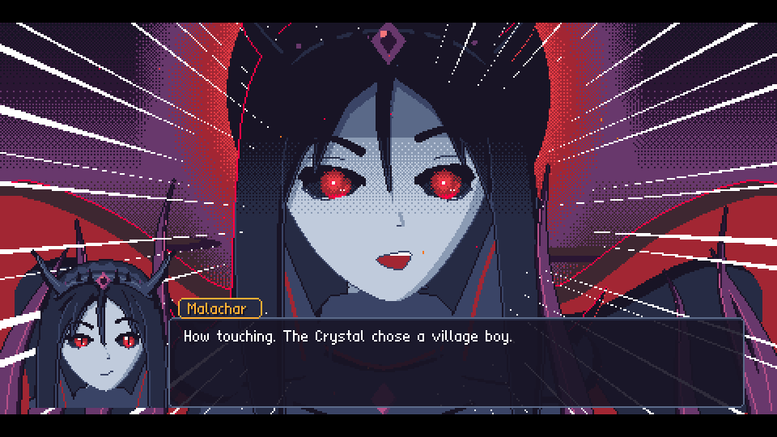
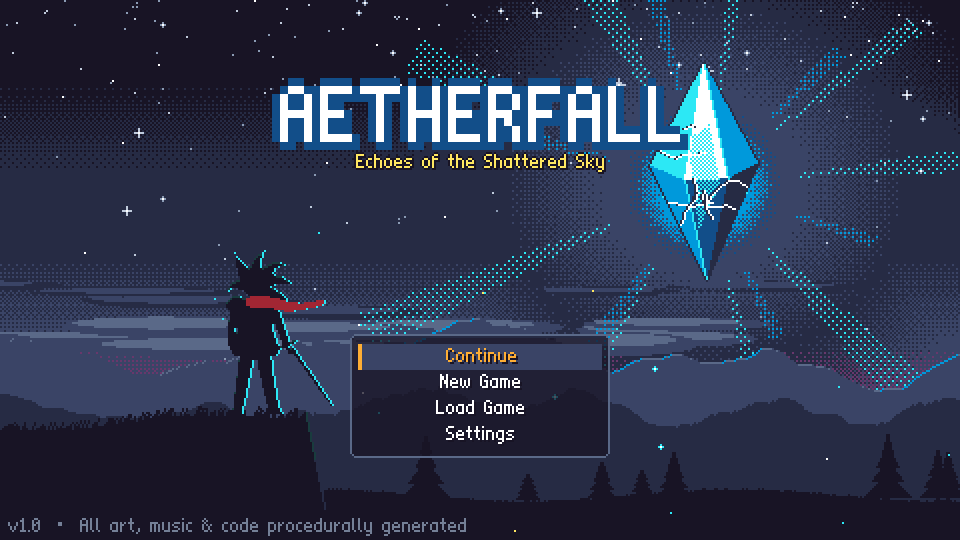
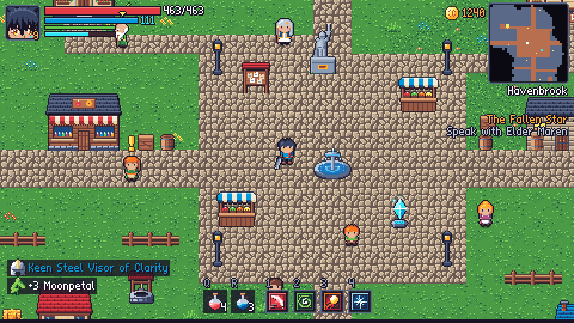
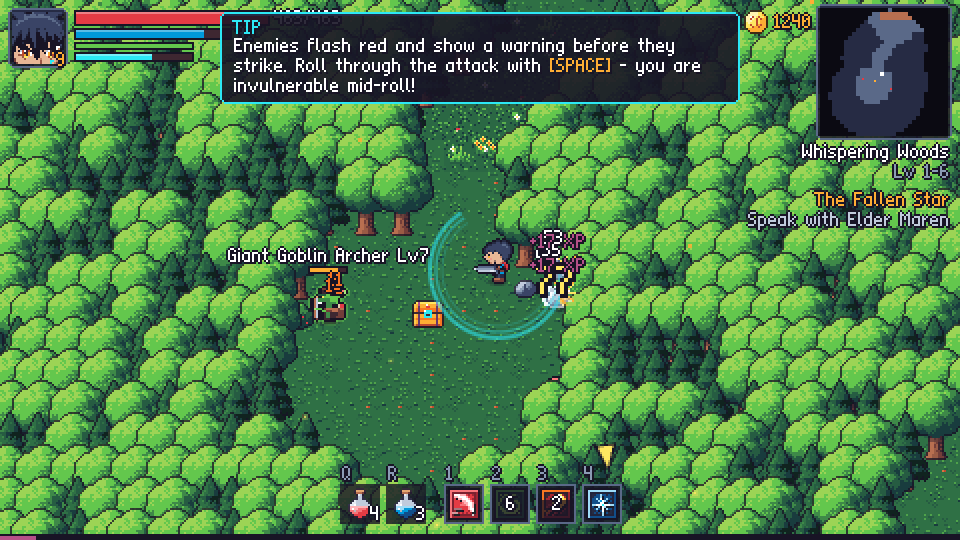
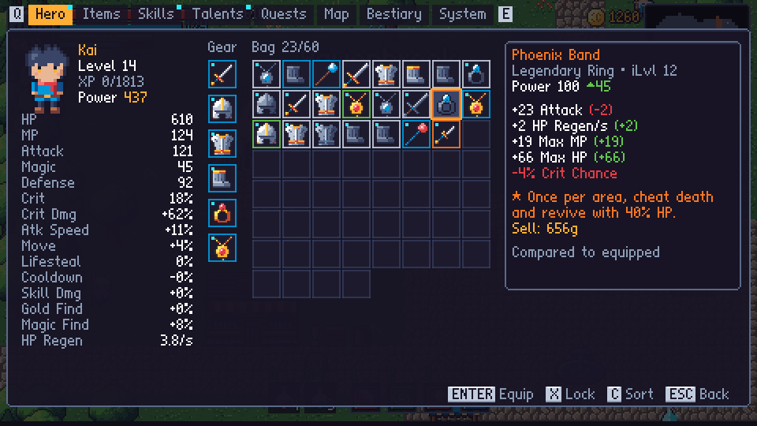
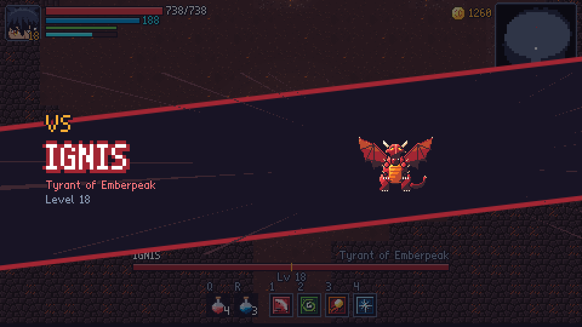
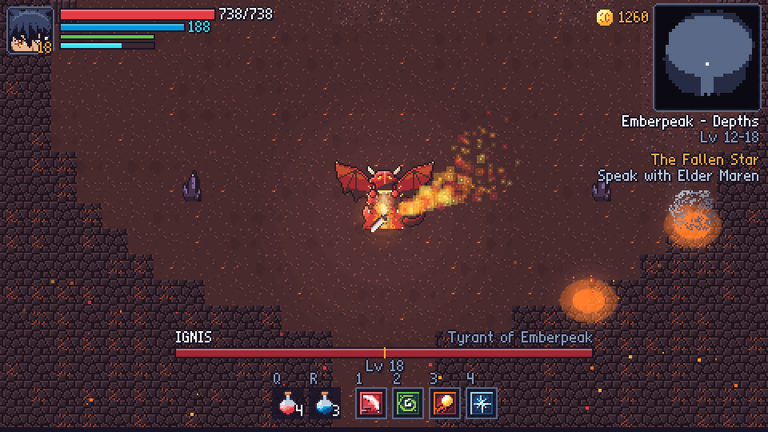

# Aetherfall — Echoes of the Shattered Sky

A pixel-art action RPG with anime cutscenes that runs in the browser. It has Souls-style
dodge-roll combat, Diablo-style loot, a skill tree, five boss fights and an endless post-game.
The art, music and sound effects are all generated in code; the repo contains no image or audio files.

**▶ Play it: https://caseyrmorrison.github.io/aetherfall/**



|                                                                |                                                                         |
| -------------------------------------------------------------- | ----------------------------------------------------------------------- |
|                     |                   |
|  |        |
|              |  |

## Features

- **Action combat.** Three-hit weapon combos, a dodge roll with invulnerability frames, and a _perfect dodge_
  (roll just as an attack lands) that slows time. Every enemy attack has a readable wind-up, so fights are hard but fair.
- **Anime cutscenes.** Illustrated story scenes in a PC-98 style, character portraits with 8 expressions,
  ultimate-attack cut-ins, "VS" boss intros, speed lines, a typewriter text effect, and hold-to-skip.
- **Five zones and five bosses.** Each boss has multiple phases and telegraphed patterns, and there's a
  transformation for the final boss. Zones are generated procedurally but always the same (seeded), and every run
  checks that all key locations are reachable.
- **Grind as much as you like.** Enemies respawn when you rest. Loot comes in five rarities with random affixes, and
  there are 10 legendaries with unique effects. Elite monsters have modifiers such as Frenzied, Vampiric and Warded.
  There are repeatable bounties and a blacksmith who upgrades (+10), salvages and reforges gear.
- **Character build.** 8 active skills, each with 5 ranks, plus an Aether Surge ultimate and 18 passive talents
  across three trees. Talents can be reset at any time.
- **Post-game.** An endless Abyss tower that scales with depth, with a boss every 5th floor, and New Game+.
- **Modern conveniences:**
  - autosave, 3 save slots, and save export/import
  - fast travel between crystals, a minimap, a full map with fog of war and a quest arrow
  - item comparison tooltips, "sell/salvage all junk", item locking, bag sorting, auto-loot
  - 4 difficulty levels you can change at any time, key rebinding and gamepad support
  - touch controls on phones
  - damage numbers, enemy health bars, aim assist
  - reduced flashing and screen-shake settings, text speed and auto-advance
  - a bestiary, a stats screen, and gold you can recover from where you died
- **Audio.** A chiptune soundtrack of 17 original tracks. Exploration music adds layers when combat starts,
  and there are 65 synthesized sound effects.

## Controls

| Action                  | Keyboard / Mouse                | Gamepad        |
| ----------------------- | ------------------------------- | -------------- |
| Move                    | WASD / Arrow keys               | Left stick     |
| Attack                  | J / Left click (aims at cursor) | X              |
| Dodge roll              | Space / K / Right click         | B              |
| Interact / talk         | E                               | A              |
| Skills 1–4              | 1 2 3 4                         | LB RB LT RT    |
| Aether Surge (ultimate) | F                               | Y              |
| Health / mana flask     | Q / R                           | D-pad ↑ / ↓    |
| Menu / Map / Pause      | Tab or I / M / Esc              | Start / Select |

All keyboard bindings can be changed in **Settings → Keyboard Controls**.

## Tech

- **TypeScript** (strict) with **Vite**, drawing on a Canvas 2D surface. There are no runtime dependencies.
  Three.js wasn't needed: the game is fully 2D and renders at a low internal resolution. That resolution is scaled up
  by a whole-number factor so the pixel art stays crisp on any screen.
- Art is generated in code: the sprites and tiles come from pixel maps and small drawing routines, and the anime art
  comes from a small software rasterizer limited to the ENDESGA-32 palette.
- Audio uses the Web Audio API. A sequencer schedules notes ahead of time and plays tracks written in a compact note
  notation, and every sound effect is built from synthesizer voices.
- Code quality: ESLint and Prettier, **Vitest** unit tests for the game logic, and GitHub Actions to run the checks and
  deploy to GitHub Pages.

```
src/
  engine/   loop & scene stack, screen scaling, input (kb/mouse/pad/touch), bitmap font, math, RNG
  game/     save model, stats, balance formulas, items & loot, quests, settings, persistence
  data/     enemies & bosses, items, skills & talents, zones, NPCs, quests, cutscene scripts
  world/    world simulation, entities (player, enemy AI, projectiles, hazards…), map generator, renderer
  scenes/   title, world, dialogue, cutscene, menus (hero, skills, talents, quests, map, bestiary…), shops
  ui/       HUD, widgets, touch controls
  art/      procedural pixel art (actors, environment, icons) and the anime renderer
  audio/    synth, sequencer, songs and sfx
tests/      unit tests (balance, items, save/state, map connectivity)
tools/      art & audio preview pages used during development
```

## Development

```bash
npm install
npm run dev        # start the dev server (open the printed URL)
npm run check      # typecheck + lint + unit tests
npm run build      # production build into dist/
```

The art and audio preview pages are served by the dev server under `/tools/`:
`preview-actors.html`, `preview-env.html`, `preview-anime.html` and `preview-audio.html`.

## License

MIT. See [LICENSE](LICENSE).
